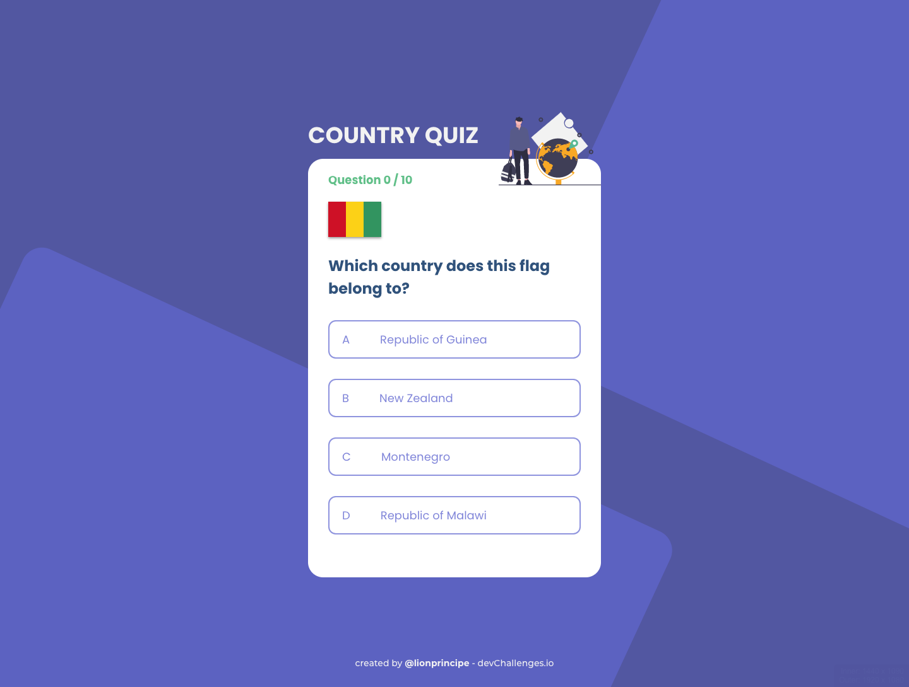

<h1 align="center">Country Quizz</h1>

<div align="center">
   Solution for a challenge from  <a href="http://devchallenges.io" target="_blank">Devchallenges.io</a>.
</div>

<div align="center">
  <h3>
    <a href="https://countries-quizz.vercel.app">
      Demo
    </a>
    <span> | </span>
    <a href="https://github.com/Lionprincipe/countries-quizz">
      Solution
    </a>
    <span> | </span>
    <a href="https://devchallenges.io/challenges/Bu3G2irnaXmfwQ8sZkw8">
      Challenge
    </a>
  </h3>
</div>

<!-- TABLE OF CONTENTS -->

## Table of Contents

- [Table of Contents](#table-of-contents)
- [Overview](#overview)
  - [Built With](#built-with)
- [Features](#features)
- [How To Use](#how-to-use)
- [Acknowledgements](#acknowledgements)
- [Contact](#contact)

<!-- OVERVIEW -->

## Overview

<div align="center">
<hr>
<h3 align="center">Desktop & Mobil</h3>
<hr>

</div>

### Built With

- [React](https://reactjs.org/)
- [typescript](https://www.typescriptlang.org/)

## Features
- [x]User story: I can see at least 2 types of questions: a city is the capital of.. or a flag belong to country..
- [x]User story: I can see select an answer
- [x]User story: I can see if my answer is correct or incorrect
- [x]User story: When I answer correctly, I can move on to the next question
- [x]User story: When I answer incorrectly, I can see my results and try again
- [x]User story: I can try again

<!-- List the features of your application or follow the template. Don't share the figma file here :) -->

This application/site was created as a submission to a [DevChallenges](https://devchallenges.io/challenges) challenge. The [challenge](https://devchallenges.io/challenges/Bu3G2irnaXmfwQ8sZkw8) was to build an application to complete the given user stories.

## How To Use

<!-- Example: -->

To clone and run this application, you'll need [Git](https://git-scm.com) and [Node.js](https://nodejs.org/en/download/) (which comes with [npm](http://npmjs.com)) installed on your computer. From your command line:

```bash
# Clone this repository
$ git clone https://github.com/your-user-name/your-project-name

# Install dependencies
$ npm install

# Run the app
$ npm start
```

## Acknowledgements

<!-- This section should list any articles or add-ons/plugins that helps you to complete the project. This is optional but it will help you in the future. For example: -->

- [Steps to replicate a design with only HTML and CSS](https://devchallenges-blogs.web.app/how-to-replicate-design/)
- [Node.js](https://nodejs.org/)
- [Marked - a markdown parser](https://github.com/chjj/marked)


## Contact

- GitHub [@Lionprincipe](https://github.com/Lionprincipe)
- Twitter [@mouendoulionel](https://twitter.com/mouendoulionel)

